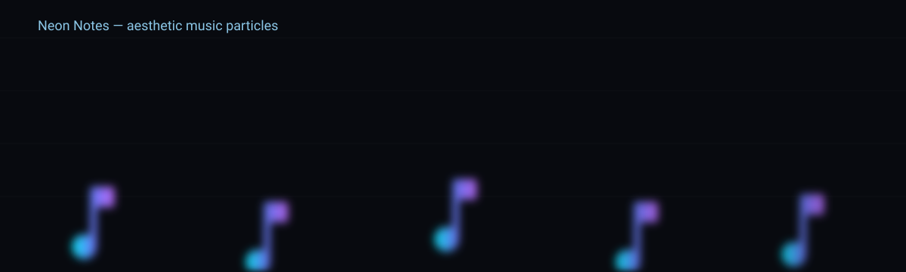
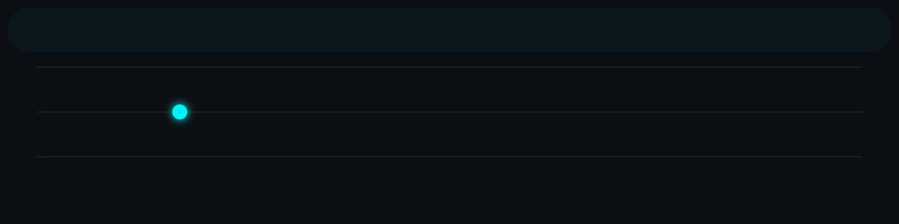

<!-- 🌌 Advanced GitHub Profile README for Kawsar Ahmed -->

<h1 align="center">
  
</h1>

  

---

## 🧠 About Me

💻 I’m a **CSE Student at the University of Chittagong**  
🚀 Passionate about **Web Development & Artificial Intelligence**  
🧩 Currently learning **Data Structures and Algorithms**  
🎯 Focused on writing clean, efficient, and elegant code  
📫 Reach me: **[kawsar.cse.cu@gmail.com](mailto:kawsar.cse.cu@gmail.com)**  

---

## ⚙️ Skills & Tools

  

---

## 📊 GitHub Stats

  
  

  

---

## 🏆 Trophies & Achievements

  

---

## 🎵 Now Playing on Spotify

  

---

## ⚡️ sitar string wave

  

---

## 🌍 Visitor Count

  

---

## 🌐 Connect With Me

  
  
  

---

  
    
  
   
  <b>⭐ Thanks for visiting! Feel free to star any repo you like. ⭐</b>

